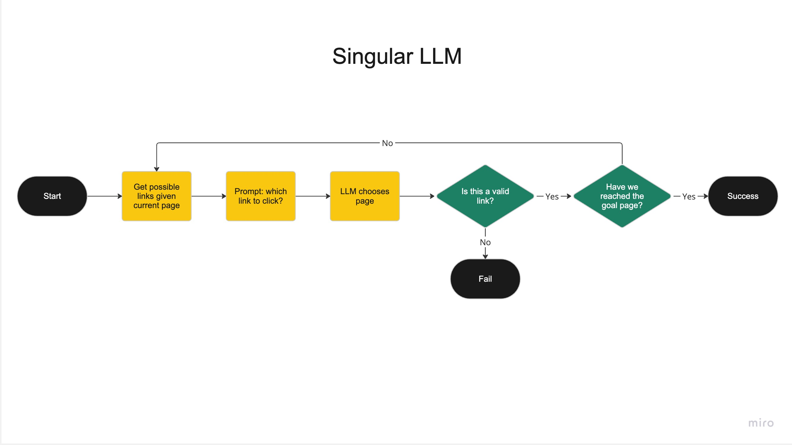
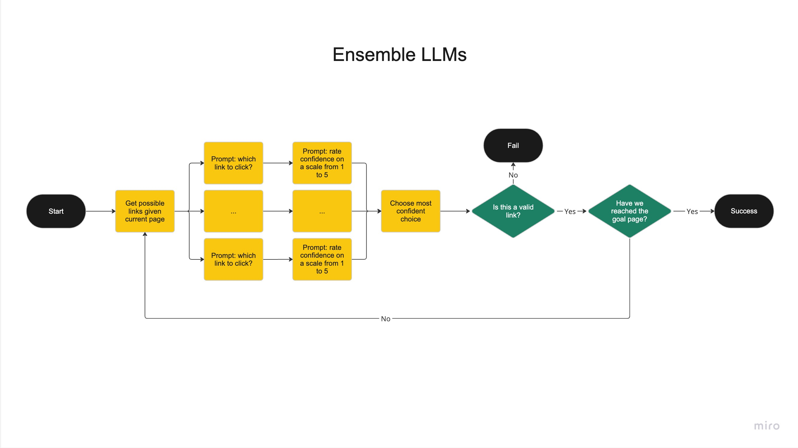
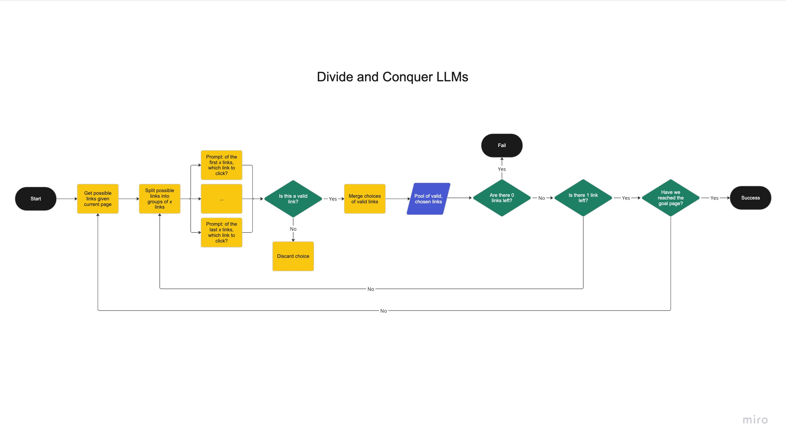
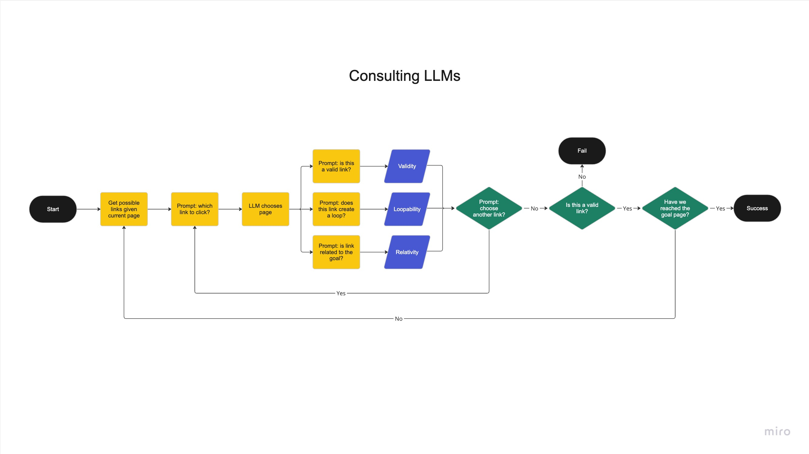
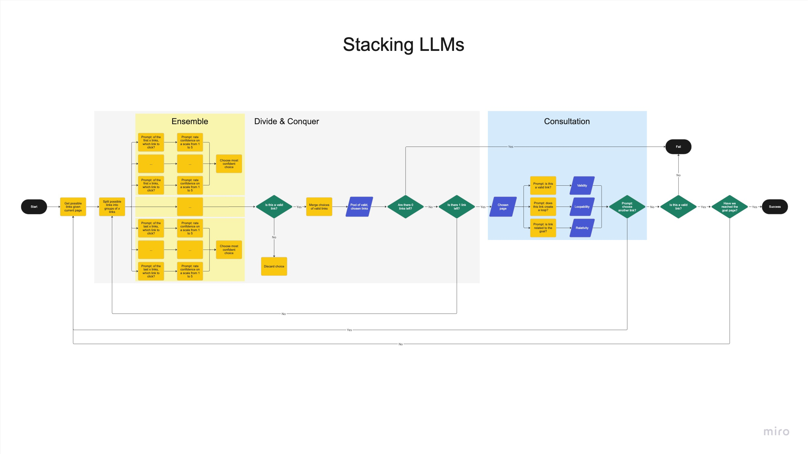

# Interacting LLMs Play Wikirace

Large language models (LLMs) often have issues with limited context length, hallucination, and a variety of other issues. This repo explores methods to have multiple, interacting LLMs to address these issues through the game of Wikirace.

## Wikirace

Wikirace is a game where you are given a starting Wikipedia page and an ending page. The goal is to get to the ending page by only clicking on the links on each page. When applied to LLMs, the LLMs are provided a goal, a description of the goal page, and a set of possible links to click at each page and are asked to determine which link to click next. For comparison, they will be pitted against a classic graph search algorithm to determine the shortest path between the start and end pages. This will be tested in a small subset of Wikipedia pages that was scraped using [Wikipedia-API](https://github.com/martin-majlis/Wikipedia-API).

In order to measure how well the method is doing, it will be rated on various factors such as number of links clicked and runtime. The method will also be judged depending on if the method even reached the end or not as a result of looping, dead-ends, or invalid links.

## Agents

The agents used were mostly with [Google's Flan T5](https://huggingface.co/google/flan-t5-large). It's good enough to understand semantics and relationships between words and lightweight enough that it can run swiftly, but not good enough that a singular LLM can excel at the task of Wikirace. This makes it an ideal agent for testing interacting LLMs, as there is now definitely room for visible improvement.

## Methods

### Breadth-First Search (BFS)

As a base, a basic breadth-first search algorithm is implemented to find the guaranteed fastest way from the start to the finish. While not as fast and efficient as A\*, since it will always find the shortest path between two points, all other methods will be compared to BFS.

### A\*

**_Note: A\* has not been implemented yet due to complications with determining the heuristics function to compute the distance between two Wikipedia links._**

A\* is implemented as a secondary base algorithm that runs faster than BFS and is highly likely to find the fastest path to from start to end, but isn't guaranteed. The heuristics function that will be used to determine the distance between two nodes will be cosine similarity.

### Singular LLM



### Ensemble LLMS



### Divide and Conquer LLMS



### Consultation LLMS



### Stacking



## Running the Code

### Setup

To setup, start by creating a conda environment. The code has been tested most extensively with Python 3.10. You may use the following example:
```bash
conda create --name wikiracer python=3.10
```

To install packages, use the `requirements.txt` file with pip:
```bash
pip install -r requirements.txt
```

PyTorch can be machine specific, so it is not included in the `requirements.txt` file. Please download the appropriate version or PyTorch on their [official website](https://pytorch.org/get-started/locally/).

## Authors

[Grant Cheng](https://github.com/CatFish47)